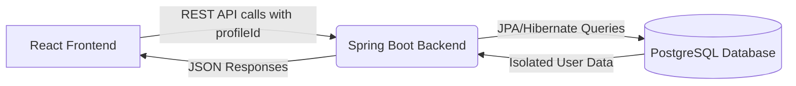

# UFit - Fitness Tracker

UFit is a comprehensive fitness and nutrition tracking application designed to help users log workouts, monitor daily caloric intake, and manage personal health goals. 

## 🚀 Live Demo

- **Frontend**: [https://fitness-tracker-rho-ten.vercel.app](https://fitness-tracker-rho-ten.vercel.app)
- **Backend API**: [https://fitnesstracker-production-ce10.up.railway.app](https://fitnesstracker-production-ce10.up.railway.app)

## 🛠️ Technology Stack

### Frontend
- **Framework**: React.js with Vite
- **Language**: JavaScript (JSX)
- **Styling**: Vanilla CSS with CSS Variables for consistent theming
- **Hosting**: Vercel

### Backend
- **Framework**: Spring Boot (Java 21)
- **Database**: PostgreSQL
- **Data Access**: Spring Data JPA / Hibernate
- **Containerization**: Docker (Multi-stage build)
- **Hosting**: Railway

## ✨ Key Features

- **User Authentication**: Secure profile creation and login system with data isolation.
- **Nutrition Tracking**: Log daily meals, calculate caloric intake, and track macronutrients (Protein, Carbs, Fat) using local database.
- **Water Tracking**: Monitor daily water consumption.
- **Exercise Logging**: Record workouts, sets, reps, and track calories burned.
- **Daily Goals**: Set and monitor daily caloric and macronutrient goals.
- **Dark/Minimal UI**: Clean, responsive, and modern user interface focused on usability.

## 🔄 Application Workflow

### 1. User Authentication & Onboarding
1. **Login/Register (`LoginScreen.jsx`)**: The user creates an account or logs in. The frontend sends a `POST /api/profiles/register` or `/login` request.
2. **Backend Processing (`UserProfileService`)**: The backend securely hashes the password using SHA-256 and stores/verifies the credentials in the `user_profiles` table.
3. **Session Management**: Upon success, the backend returns the user's profile data (scrubbed of the password). The frontend stores the `profileId` and `username` in browser `localStorage`.
4. **Profile Setup (`ProfileSetup.jsx`)**: New users complete a setup questionnaire (age, weight, goals, dietary preferences). The frontend calls `PUT /api/profiles/{id}` to update the user's profile.

### 2. Daily Tracking (Food, Water, Exercise)
All tracking actions are scoped to the active user using their `profileId`.

- **Logging Data**: When a user logs a meal in `CalorieTracker.jsx` or a workout in `ExerciseLogger.jsx`, the frontend makes an API call containing the `profileId` in the URL (e.g., `POST /api/food/{profileId}/log/{date}`).
- **Database Storage**: The backend controller routes the request to the appropriate service (`CalorieService` or `ExerciseService`). The service saves the entity (`FoodLog`, `WaterLog`, `ExerciseLog`) with the `profileId` foreign key, ensuring strict data isolation.
- **Retrieving Summaries**: The frontend periodically fetches daily summaries (e.g., `GET /api/food/{profileId}/summary/{date}`). The backend services use custom repository queries to sum up calories, macros, and water intake specific to that user and date.

### 3. Goal Management
1. **Setting Goals**: Users can define their daily caloric and macro targets. The frontend sends a `POST /api/food/{profileId}/goal`.
2. **Backend Storage**: The `CalorieService` stores a `DailyGoal` record linked to the user's `profileId` and the specific date.
3. **Progress Calculation**: When fetching daily summaries, the backend compares the user's logged intake against their active `DailyGoal` and returns the progress percentages to the frontend.

### 4. Data Flow Architecture


## 🏗️ Local Development Setup

### Prerequisites
- Node.js (v18+)
- Java 21+
- Maven
- PostgreSQL

### 1. Database Setup
1. Ensure PostgreSQL is running locally on port `5432`.
2. Create a database named `ufitdb`.
3. The default credentials in `application.properties` expect username `postgres` and password `4589`. Update these if your local setup differs.

### 2. Backend Setup
```bash
# From the project root directory
mvnw clean compile
mvnw spring-boot:run
```
The backend will start on `http://localhost:8080`.

### 3. Frontend Setup
```bash
# Navigate to the frontend directory
cd frontend

# Install dependencies
npm install

# Start the development server
npm run dev
```
The frontend will be available at `http://localhost:5173`.

## 📦 Deployment

### Frontend (Vercel)
The frontend is continuously deployed via Vercel. 
- Ensure the `VITE_API_URL` environment variable is set to the Railway backend URL (e.g., `https://fitnesstracker-production-ce10.up.railway.app/api`).

### Backend (Railway)
The backend is deployed via Docker on Railway.
- **Environment Variables**:
  - `DATABASE_URL`: Connection string to the Railway PostgreSQL instance.
  - `CORS_ORIGINS`: Comma-separated list of allowed frontend origins (e.g., `https://fitness-tracker-rho-ten.vercel.app`).
  - `DDL_AUTO`: Typically set to `update` to automatically apply schema changes without dropping data.

## 📄 License
This project is licensed under the MIT License.
